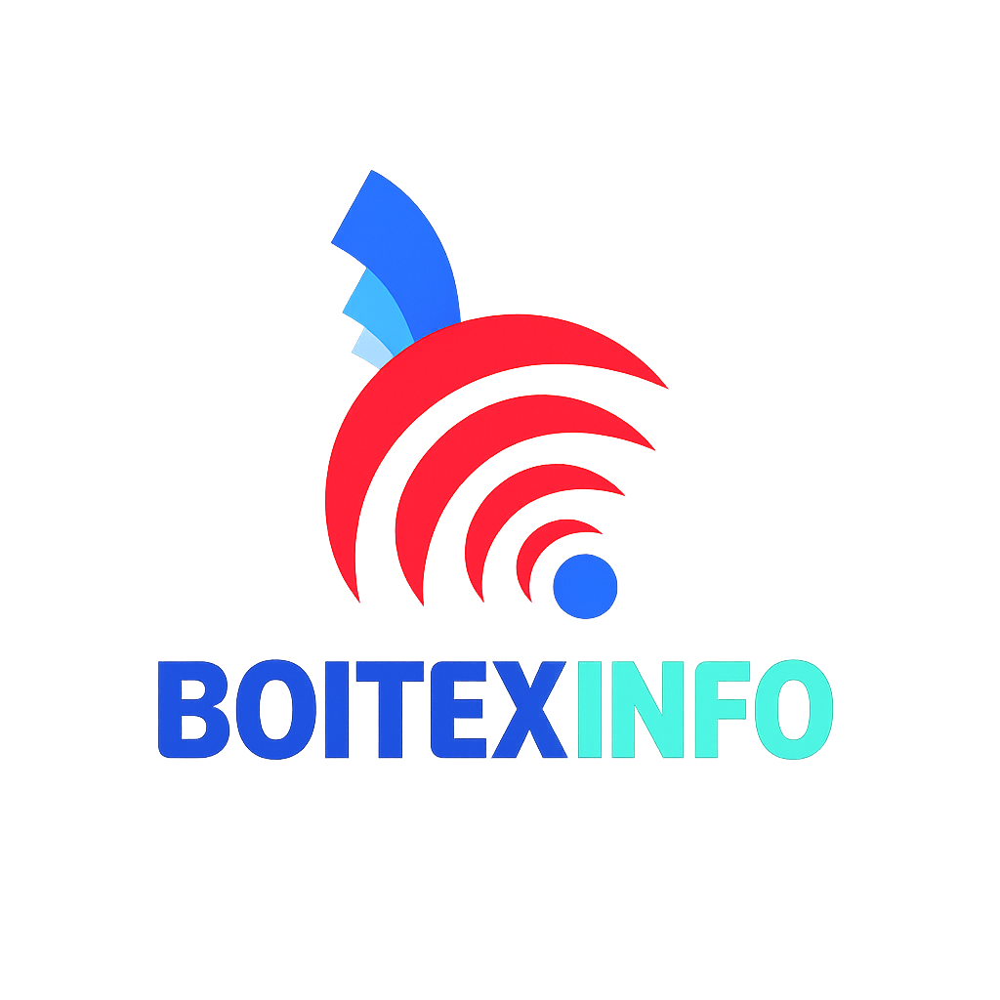

Of course\! A good README is essential for any GitHub project. It's the first thing people see, and it should clearly explain what your project is, how to use it, and how to contribute.

Based on the files you've provided, here is a comprehensive and well-structured README file for your Boitex Info App. You can copy and paste this directly into your `README.md` file.

-----

# Boitex Info App

\<p align="center"\>
\
\</p\>

\<p align="center"\>
The official mobile application for Boitex Info, designed to streamline business operations and management.
\<br /\>
\<a href="\#about-the-project"\>\<strong\>Explore the docs »\</strong\>\</a\>
\<br /\>
\<br /\>
\<a href="\#getting-started"\>Getting Started\</a\>
·
\<a href="\#features"\>Features\</a\>
·
\<a href="\#contributing"\>Contributing\</a\>
\</p\>

-----

## About The Project

The Boitex Info App is a comprehensive, cross-platform mobile application built with Flutter. It serves as a central hub for managing various aspects of the business, including client relations, project management, technical services, and internal administration. The app is designed with a role-based access system, providing tailored dashboards and functionalities for different user groups such as administrators, IT services, and technical teams.

This application leverages the power of Firebase for its backend, ensuring real-time data synchronization, secure authentication, and scalable file storage.

-----

## Features

The Boitex Info App is packed with features to enhance productivity and streamline workflows:

  * **Authentication**: Secure user login and role-based access control.
  * **Dashboards**: Customized dashboards for Administration, IT Services, and Technical Services, providing at-a-glance information and quick access to key functionalities.
  * **Client Management**: Add, view, and manage client information.
  * **Project Management**: Track projects, manage details, and oversee project lifecycles.
  * **Product Catalog**: A comprehensive catalog of products with details and management options.
  * **Stock Management**: Keep track of product stock levels and manage inventory.
  * **Mission Management**: Create, assign, and track missions for technical teams.
  * **Barcode Scanning**: Integrated barcode scanner for easy product identification and management.
  * **SAV (After-Sales Service)**: Manage SAV tickets, interventions, and customer support.
  * **PDF Generation**: Generate and share professional reports, including installation and intervention reports, with digital signature capture.
  * **Real-time Notifications**: Keep users informed with push notifications for important events and updates.
  * **And much more**: Including delivery tracking, purchase requisition, and activity logging.

-----

## Technologies Used

This project is built with a modern tech stack, ensuring a robust and scalable application.

**Frontend:**

  * [Flutter](https://flutter.dev/)

**Backend & Cloud Services:**

  * [Firebase Core](https://firebase.google.com/docs/flutter/setup)
  * [Firebase Authentication](https://firebase.google.com/docs/auth)
  * [Cloud Firestore](https://firebase.google.com/docs/firestore)
  * [Firebase Storage](https://firebase.google.com/docs/storage)
  * [Firebase Messaging](https://firebase.google.com/docs/cloud-messaging)

**Key Packages:**

  * `mobile_scanner`: For barcode scanning.
  * `signature`: For capturing user signatures.
  * `printing` & `pdf`: For generating and printing PDF documents.
  * `share_plus`: For sharing content from the app.
  * `google_fonts`: For custom fonts.
  * And many more, as listed in the `pubspec.yaml` file.

-----

## Project Structure

The project is organized into a clean and scalable structure:

```
lib/
├── api/                  # Firebase API services
├── models/               # Data models for the app
├── screens/              # UI screens for different modules
│   ├── administration/   # Admin-specific screens
│   ├── service_it/       # IT service screens
│   ├── service_technique/ # Technical service screens
│   ├── auth_gate.dart    # Handles user authentication state
│   └── ...
├── services/             # Business logic and services
├── utils/                # Utility functions and constants
├── widgets/              # Reusable UI components
├── main.dart             # App entry point
└── firebase_options.dart # Firebase configuration
```

-----

## Getting Started

To get a local copy up and running, follow these simple steps.

### Prerequisites

  * **Flutter SDK**: Make sure you have the Flutter SDK installed. For installation instructions, refer to the [official Flutter documentation](https://flutter.dev/docs/get-started/install).
  * **IDE**: An IDE with Flutter support, such as VS Code or Android Studio.

### Installation

1.  **Clone the repo**
    ```sh
    git clone https://github.com/your_username/Boitex-Info-App.git
    ```
2.  **Navigate to the project directory**
    ```sh
    cd Boitex-Info-App
    ```
3.  **Install dependencies**
    ```sh
    flutter pub get
    ```

### Firebase Setup

This project uses Firebase for its backend services. To connect the app to your own Firebase project, follow these steps:

1.  Create a new project on the [Firebase Console](https://console.firebase.google.com/).
2.  Add an Android and/or iOS app to your Firebase project.
3.  Follow the setup instructions to download the `google-services.json` file for Android and the `GoogleService-Info.plist` for iOS.
4.  Place the `google-services.json` file in the `android/app/` directory.
5.  Place the `GoogleService-Info.plist` file in the `ios/Runner/` directory.
6.  Enable the following Firebase services:
      * Authentication (Email/Password)
      * Cloud Firestore
      * Firebase Storage
      * Firebase Messaging

### Running the App

Once the setup is complete, you can run the app on an emulator or a physical device:

```sh
flutter run
```

-----

## Screenshots

*(Here you can add screenshots or GIFs of your application to give a visual representation of the app.)*

| Login Screen | Admin Dashboard |
| :----------: | :-------------: |
|  *Your Screenshot Here* |  *Your Screenshot Here* |

-----

## Contributing

Contributions are what make the open-source community such an amazing place to learn, inspire, and create. Any contributions you make are **greatly appreciated**.

If you have a suggestion that would make this better, please fork the repo and create a pull request. You can also simply open an issue with the tag "enhancement".
Don't forget to give the project a star\! Thanks again\!

1.  Fork the Project
2.  Create your Feature Branch (`git checkout -b feature/AmazingFeature`)
3.  Commit your Changes (`git commit -m 'Add some AmazingFeature'`)
4.  Push to the Branch (`git push origin feature/AmazingFeature`)
5.  Open a Pull Request

-----

## License

Distributed under the MIT License. See `LICENSE` for more information.

-----
